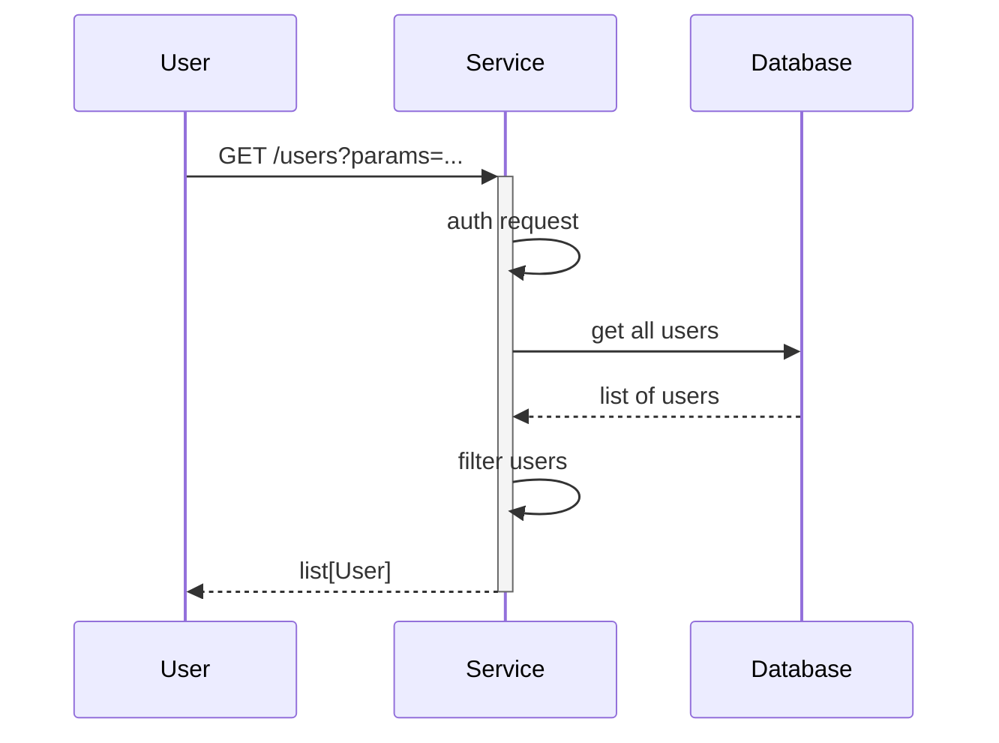

# Clinical Data Gateway API

[](https://github.com/NHSDigital/clinical-data-gateway-api/actions/workflows/cicd-1-pull-request.yaml)
[](https://sonarcloud.io/summary/new_code?id=NHSDigital_clinical-data-gateway-api)

Repository housing all code responsible for handling the Clinical Data Gateway APIs. This repository houses the various Python modules responsible for managing logic within the APIs, as well as all the Terraform code responsible for deploying the APIs within an environment.

The Clinical Data Gateway APIs look to provide the [GP Connect](https://digital.nhs.uk/services/gp-connect) APIs over the internet, via the [API Management platform](https://digital.nhs.uk/services/api-platform). More details on the GP Connect specifications can be found on the [GP connect specifications for developers](https://digital.nhs.uk/services/gp-connect/develop-gp-connect-services/specifications-for-developers) page.

## Table of Contents

- [Clinical Data Gateway API](#clinical-data-gateway-api)
  - [Table of Contents](#table-of-contents)
  - [Setup](#setup)
    - [Prerequisites](#prerequisites)
    - [Configuration](#configuration)
  - [Usage](#usage)
    - [Testing](#testing)
  - [Design](#design)
    - [Diagrams](#diagrams)
    - [Modularity](#modularity)
  - [Contributing](#contributing)
  - [Contacts](#contacts)
  - [Licence](#licence)

## Setup

Clone the repository.

```shell
git clone git@github.com:NHSDigital/clinical-data-gateway-api.git
cd clinical-data-gateway-api.git
```

### External Dependencies

This project depends on the [clinical-data-common](https://github.com/NHSDigital/clinical-data-common) library, which provides shared code and utilities used across various clinical data API products. The dependency is managed via Poetry and installed directly from the GitHub repository.

The library is referenced in `gateway-api/pyproject.toml` as a git dependency. The CI/CD pipeline is currently configured to pull the latest version from the specified branch automatically.

The project can then be build within a [Dev Container](https://containers.dev/) as defined within the file outlined under `.vscode/devcontainer.json`. When opening the project within Visual Studio Code, if the [Dev Containers extension](https://marketplace.visualstudio.com/items?itemName=ms-vscode-remote.remote-containers), you should be prompted if you wish to re-open the folder within a Dev Container. If accepted, this should build the Dev Container locally which will include all required libraries and tools for development.

> [!NOTE]<br>
> If any additional certificates need to be trusted when building locally, these can be added to the `infrastructure/images/build-container/resources/dev-certificates` directory. These certificates will then automatically be trusted by the build container.
> A ca certificate can also be provided by including the `DEV_CERT_FILENAME` environment variable. This filename needs to match one of the files included within the `dev-certificates` directory. This is often easiest setup via an environment variable, included within your shell's profile (`.bashrc`, `.zshrc`, etc):
>
> ```shell
> export DEV_CERT_FILENAME=<dev_cert_filename>
> ```

### Prerequisites

The following software packages, or their equivalents, are expected to be installed and configured:

- A container manager for running containers locally, such as [Colima](https://github.com/abiosoft/colima) on Mac OS, or [Docker](https://docs.docker.com/engine/install/) within Windows Subsystem for Linux on Windows or Linux natively.
- [GNU make](https://www.gnu.org/software/make/) 3.82 or later,

> [!NOTE]<br>
> The version of GNU make available by default on macOS is earlier than 3.82. You will need to upgrade it or certain `make` tasks will fail. On macOS, you will need [Homebrew](https://brew.sh/) installed, then to install `make`, like so:
>
> ```shell
> brew install make
> ```
>
> You will then see instructions to fix your [`$PATH`](https://github.com/nhs-england-tools/dotfiles/blob/main/dot_path.tmpl) variable to make the newly installed version available. If you are using [dotfiles](https://github.com/nhs-england-tools/dotfiles), this is all done for you.

- [GNU sed](https://www.gnu.org/software/sed/) and [GNU grep](https://www.gnu.org/software/grep/) are required for the scripted command-line output processing,
- [GNU coreutils](https://www.gnu.org/software/coreutils/) and [GNU binutils](https://www.gnu.org/software/binutils/) may be required to build dependencies like Python, which may need to be compiled during installation,

> [!NOTE]<br>
> For macOS users, installation of the GNU toolchain has been scripted and automated as part of the `dotfiles` project. Please see this [script](https://github.com/nhs-england-tools/dotfiles/blob/main/assets/20-install-base-packages.macos.sh) for details.

### Configuration

Installation and configuration of the toolchain dependencies is completed as part of building the Dev container as described above.

## Usage

Once the build container has been built and is up and running. A few different make targets are provided for installing dependencies and building the codebase.

- `dependencies` - installs all dependencies required for the project
- `build` - builds the codebase so that it is ready for deployment
- `deploy` - builds the codebase and deploys it within a separate container locally.
- `clean` - stop and remove any containers outside of the Dev container locally.

### Testing

There are `make` tasks for you to configure to run your tests.  Run `make test` to see how they work.  You should be able to use the same entry points for local development as in your CI pipeline.

#### Continuous Integration

More documentation on the GitHub actions utilised to support continuous integration can be found on the [Continuous Integration](./.github/github_actions.md) page.

## Design

### Diagrams

The [C4 model](https://c4model.com/) is a simple and intuitive way to create software architecture diagrams that are clear, consistent, scalable and most importantly collaborative. This should result in documenting all the system interfaces, external dependencies and integration points.


The source for diagrams should be in Git for change control and review purposes. Recommendations are [draw.io](https://app.diagrams.net/) (example above in [docs](.docs/diagrams/) folder) and [Mermaids](https://github.com/mermaid-js/mermaid). Here is an example Mermaids sequence diagram:



### Modularity

Most of the projects are built with customisability and extendability in mind. At a minimum, this can be achieved by implementing service level configuration options and settings. The intention of this section is to show how this can be used. If the system processes data, you could mention here for example how the input is prepared for testing - anonymised, synthetic or live data.

## Contributing

Describe or link templates on how to raise an issue, feature request or make a contribution to the codebase. Reference the other documentation files, like

- Environment setup for contribution, i.e. `CONTRIBUTING.md`
- Coding standards, branching, linting, practices for development and testing
- Release process, versioning, changelog
- Backlog, board, roadmap, ways of working
- High-level requirements, guiding principles, decision records, etc.

### Signed Commits

To be able to contribute to the repository, any commits created need to be signed. See the [commit signing setup guide page](https://github.com/NHSDigital/software-engineering-quality-framework/blob/main/practices/guides/commit-signing.md) for guidance on setting up this up.

## Contacts

Provide a way to contact the owners of this project. It can be a team, an individual or information on the means of getting in touch via active communication channels, e.g. opening a GitHub discussion, raising an issue, etc.

## Licence

> The [LICENCE.md](./LICENCE.md) file will need to be updated with the correct year and owner

Unless stated otherwise, the codebase is released under the MIT License. This covers both the codebase and any sample code in the documentation.

Any HTML or Markdown documentation is [© Crown Copyright](https://www.nationalarchives.gov.uk/information-management/re-using-public-sector-information/uk-government-licensing-framework/crown-copyright/) and available under the terms of the [Open Government Licence v3.0](https://www.nationalarchives.gov.uk/doc/open-government-licence/version/3/)
