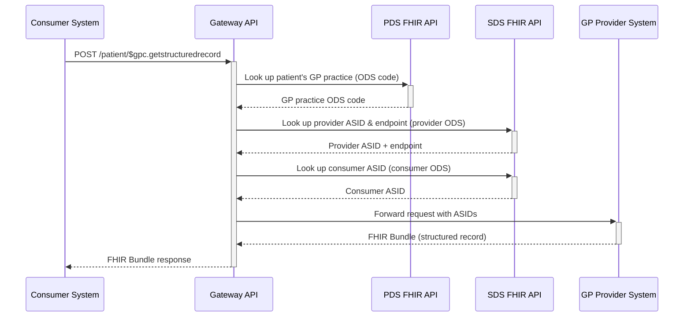

# Clinical Data Gateway API

[](https://github.com/NHSDigital/clinical-data-gateway-api/actions/workflows/cicd-1-pull-request.yaml)
[](https://sonarcloud.io/summary/new_code?id=NHSDigital_clinical-data-gateway-api)

The Clinical Data Gateway API exposes [GP Connect](https://digital.nhs.uk/services/gp-connect) services over the internet via the NHS [API Management platform](https://digital.nhs.uk/services/api-platform). It receives requests from consumer systems, validates and enriches them using NHS spine services, and forwards them to the patient's GP provider system to retrieve structured clinical records.

For detailed GP Connect specifications, see [GP Connect specifications for developers](https://digital.nhs.uk/services/gp-connect/develop-gp-connect-services/specifications-for-developers).

## Table of Contents

- [Architecture Overview](#architecture-overview)
- [Tech Stack](#tech-stack)
- [Repository Structure](#repository-structure)
- [Setup](#setup)
- [Usage](#usage)
- [Testing](#testing)
- [Design](#design)
- [CI/CD](#cicd)
- [Proxygen](#proxygen)
- [Licence](#licence)

## Architecture Overview

When a consumer system sends a request to the Gateway API, the following orchestration takes place:


```mermaid
sequenceDiagram
    participant Consumer as Consumer System
    participant Gateway as Gateway API
    participant PDS as PDS FHIR API
    participant SDS as SDS FHIR API
    participant Provider as GP Provider System

    Consumer->>+Gateway: POST /patient/$gpc.getstructuredrecord
    Gateway->>+PDS: Look up patient's GP practice (ODS code)
    PDS-->>-Gateway: GP practice ODS code
    Gateway->>+SDS: Look up provider ASID & endpoint (provider ODS)
    SDS-->>-Gateway: Provider ASID + endpoint
    Gateway->>+SDS: Look up consumer ASID (consumer ODS)
    SDS-->>-Gateway: Consumer ASID
    Gateway->>+Provider: Forward request with ASIDs
    Provider-->>-Gateway: FHIR Bundle (structured record)
    Gateway-->>-Consumer: FHIR Bundle response
```

**Key NHS services used:**

| Service | Purpose |
| --- | --- |
| [PDS FHIR API](https://digital.nhs.uk/developer/api-catalogue/personal-demographics-service-fhir) | Looks up the patient's registered GP practice code |
| [SDS FHIR API](https://digital.nhs.uk/developer/api-catalogue/spine-directory-service-fhir) | Resolves provider/consumer endpoint details and ASID values |
| GP Provider System | The patient's GP system that returns the clinical record |

## Tech Stack

| Component | Technology |
| --- | --- |
| Language | Python 3.14+ |
| Web framework | [Flask](https://flask.palletsprojects.com/) |
| Dependency management | [Poetry](https://python-poetry.org/) |
| API specification | [OpenAPI 3.0](gateway-api/openapi.yaml) |
| Data models | FHIR (Fast Healthcare Interoperability Resources) |
| Infrastructure | Terraform, Docker |
| Testing | pytest, pytest-bdd, Pact, Schemathesis |
| Static analysis | mypy (strict mode), Ruff |

## Repository Structure

```text
├── gateway-api/                  # Application code and tests
│   ├── openapi.yaml              # OpenAPI specification
│   ├── pyproject.toml            # Python project and dependency definitions
│   ├── src/
│   │   ├── gateway_api/          # Flask application
│   │   │   ├── app.py            # Flask routes and entrypoint
│   │   │   ├── controller.py     # Orchestrates PDS → SDS → Provider calls
│   │   │   ├── get_structured_record/  # Request model
│   │   │   ├── pds/              # PDS FHIR API client
│   │   │   ├── sds/              # SDS FHIR API client
│   │   │   ├── provider/         # GP Provider client
│   │   │   └── common/           # Shared utilities and error handling
│   │   └── fhir/                 # FHIR resource data models
│   ├── stubs/                    # API stubs for local testing
│   └── tests/                    # Test suites (see Testing section)
├── infrastructure/               # Terraform modules and Docker images
│   ├── environments/             # Environment-specific config (dev, preview)
│   ├── images/                   # Dockerfiles (build container, gateway-api)
│   └── modules/                  # Terraform modules
├── proxygen/                     # API proxy deployment configuration
├── scripts/                      # Build, test, and CI/CD scripts
└── bruno/                        # Bruno API collection for manual testing
```

For more detail on the test suites, see the [tests README](gateway-api/tests/README.md).

## Setup

### Clone the Repository

```shell
git clone git@github.com:NHSDigital/clinical-data-gateway-api.git
cd clinical-data-gateway-api
```

### Dev Container (Recommended)

The project is configured to run inside a [Dev Container](https://containers.dev/) defined in `.devcontainer/devcontainer.json`. When you open the project in VS Code with the [Dev Containers extension](https://marketplace.visualstudio.com/items?itemName=ms-vscode-remote.remote-containers) installed, you will be prompted to reopen in the container. This automatically installs all required libraries and tools.

The dev container sits on the same network, `gateway-local`, as [the `gateway-api` container](infrastructure/README.md#docker-images), if deployed. Docker DNS will resolve <http://gateway-api> to the deployed Gateway API.

> [!NOTE]
> **WSL users:** Configure the Dev Containers extension with `{"dev.containers.executeInWSL": true}`, clone the repository into the WSL filesystem, connect VS Code to WSL first, then open the repository folder and build the container.

### Prerequisites

- A container runtime such as [Docker](https://docs.docker.com/engine/install/) (Linux/WSL) or [Colima](https://github.com/abiosoft/colima) (macOS)

### External Dependencies

This project depends on the [clinical-data-common](https://github.com/NHSDigital/clinical-data-common) library for shared utilities. It is declared as a Git dependency in `gateway-api/pyproject.toml` and installed automatically by Poetry.

## Usage

The project uses `make` targets to build, deploy, and manage the application. Run these from the repository root:

| Command | Description |
| --- | --- |
| `make dependencies` | Install all project dependencies via Poetry |
| `make build` | Type-check, package, and build the Docker image |
| `make env` | Create a `.env` to be consumed when starting the app, e.g. `make deploy` |
| `make deploy` | Build and start the Gateway API container using the environment variables defined in `.env` |
| `make clean` | Stop and remove the Gateway API container |
| `make config` | Configure the development environment |

### API Endpoints

Once deployed, the API exposes:

| Method | Path | Description |
| --- | --- | --- |
| `POST` | `/patient/$gpc.getstructuredrecord` | Retrieve a patient's structured clinical record |
| `GET` | `/health` | Health check endpoint |

The full API schema is defined in [gateway-api/openapi.yaml](gateway-api/openapi.yaml).

### Environment Variables

Make commands help build the `.env` and `.env.test` files used to populate the required environment variables.

#### .env

`make deploy` will feed the `.env` variables in to the app's environment.

Environment variables control whether stubs are used in place of the real PDS, SDS, and Provider services during local development.

| Variable | Description |
| --- | --- |
| `PDS_URL` | The URL for the PDS FHIR API; set as `stub` to use development stub. |
| `PDS_API_TOKEN`| Leave unset in development environment. |
| `PDS_API_SECRET`| Leave unset in development environment. |
| `PDS_API_KID`| Leave unset in development environment. |
| `SDS_URL` | The URL for the SDS FHIR API; set as `stub` to use development stub. |
| `SDS_API_TOKEN`| Leave unset in development environment. |
| `PROVIDER_URL` | The URL for the GP Provider; set as `stub` to use development stub. |
| `CDG_DEBUG` | `true`, return additional debug information when the call to the GP provider returns an error. |

See `make env-*` in `scripts/env/app/env.mk` for the commands that will write these variables to a file.

_Note: `FLASK_HOST` and `FLASK_PORT` are hardcoded in to the Dockerfile. These are for container, and do not need adjusting._

#### .env.test

| Variable | Description |
| --- | --- |
| `BASE_URL` | Protocol, hostname and port for the running API (e.g. `http://localhost:5000`, or `http://gateway-api:8080` from within the devcontainer) |
| `APIGEE_ACCESS_TOKEN` | An access token to Apigee API used by `pytest_nhds_apim`, fed from the environment variables at run time. |
| `PROXYGEN_API_NAME` | The name of the API defined in Proxygen. Used by `pytest_nhsd_apim` to run tests against, fed in the CLI arguments in `make test-*` |
| `PROXY_BASE_PATH` | The suffix of the proxy instance being deployed. Used by `pytest_nhsd_apim` to run tests against, fed in the CLI arguments in `make test-*` |
| `BASE_URL` | Set if targeting a locally deployed application; otherwise, leave unset. |
| `TARGET_ENV` | Either `local` or `remote`, to inform the HTTP client used by the tests how to behave - e.g. add auth headers, etc. |
| `REMOTE_TEST_USERNAME` | The test user through which the tests will be authenticated against when run against a remote target. |

## Testing

The project has five test suites, each targeting a different layer of confidence. The API container must be running for all suites except unit tests.

| Command | Suite | Framework | Description |
| --- | --- | --- | --- |
| `make test-unit` | Unit | pytest | Tests individual modules in isolation |
| `make test-acceptance` | Acceptance | pytest-bdd | BDD tests using Gherkin feature files |
| `make test-integration` | Integration | pytest | HTTP-level tests against the running API |
| `make test-schema` | Schema | Schemathesis | Auto-generated tests from the OpenAPI spec |
| `make test-contract` | Contract | Pact | Consumer/provider contract verification |
| `make test` | All | — | Runs every test suite |

For detailed information about each test type, directory layout, and how to run them, see the [tests README](gateway-api/tests/README.md).

## Design

### Stubs

The `gateway-api/stubs/` directory contains stub implementations of the external services (PDS, SDS, GP Provider). These are used during local development and testing so that tests can run without connecting to live NHS services. Stubs are activated via [environment variables](#environment-variables).

### Architecture Decision Records

Significant design decisions are documented as Architecture Decision Records (ADRs). The ADR format follows the [NHS England Repository Template](https://github.com/nhs-england-tools/repository-template) convention.

## CI/CD

The project uses GitHub Actions for continuous integration and deployment, organised into reusable stages:

| Workflow | Trigger | Purpose |
| --- | --- | --- |
| [Pull Request](.github/workflows/cicd-1-pull-request.yaml) | PR opened/reopened | Runs commit checks, tests, build, and acceptance |
| [Publish](.github/workflows/cicd-2-publish.yaml) | PR merged to main | Creates a release and tags the artefact |
| [Deploy](.github/workflows/cicd-3-deploy.yaml) | Manual dispatch | Deploys a selected tag to an environment |

For full details on each workflow and composite action, see the [CI/CD documentation](.github/github_actions.md).

## Proxygen

To be able to use the `load-tests` or `local-tests`, you will need to have Proxygen access setup.

- Please follow the [guide here](https://nhsd-confluence.digital.nhs.uk/spaces/DCA/pages/1236046532/Proxygen)
- When the devcontainer has built, the Proxygen configuration is created on the host at `~/gateway/ptl/.proxygen` and bind-mounted into the container as `~/.proxygen`.
- For _settings_:
  - Set the `api` value
  - `endpoint_url` and `spec_output_format` should be already set.
- For _credentials_:
  - Set the `base_url`, `client_secret`, `password` and `username` values.
  - Remove unused fields.

## Licence

Unless stated otherwise, the codebase is released under the MIT License. This covers both the codebase and any sample code in the documentation. See [LICENCE.md](./LICENCE.md).

Any HTML or Markdown documentation is [© Crown Copyright](https://www.nationalarchives.gov.uk/information-management/re-using-public-sector-information/uk-government-licensing-framework/crown-copyright/) and available under the terms of the [Open Government Licence v3.0](https://www.nationalarchives.gov.uk/doc/open-government-licence/version/3/).
