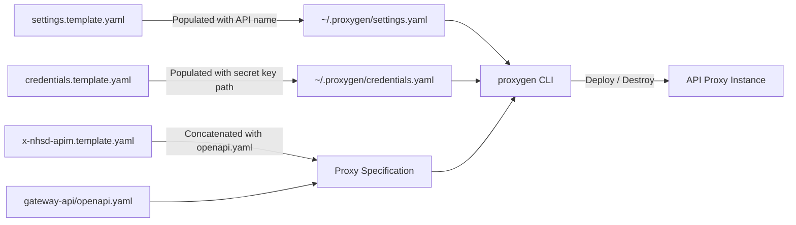

# Proxygen

Proxygen is the CLI tool created by the NHS API Platform team to support the deployment of NHS APIs. It manages the lifecycle of API proxy instances — creating, updating, and destroying them.

We use this tool in CI/CD pipelines (and can use it manually) to manage the proxy instances for the Clinical Data Gateway API.

For more information on Proxygen, [read the docs](https://nhsd-confluence.digital.nhs.uk/spaces/APM/pages/375329782/Proxygen).

## Proxygen/ Structure

```text
proxygen/
├── README.md                        # This file
├── credentials.template.yaml        # Template for Proxygen authentication credentials
├── settings.template.yaml           # Template for Proxygen CLI settings (API name, endpoint URL)
└── x-nhsd-apim.template.yaml        # Template for the custom OpenAPI extension used by Proxygen
```

## How It Works

Proxygen needs three pieces of configuration to deploy a proxy:

1. **Settings file** — tells the CLI which API to target.
2. **Credentials file** — authenticates us as the owner/maintainer of the API.
3. **Specification file** — defines the proxy behaviour using an OpenAPI spec with a custom `x-nhsd-apim` extension.

The following diagram shows how these files are assembled and used during deployment:



## Settings File

**Template:** `proxygen/settings.template.yaml`

This file tells the Proxygen CLI which API to manage and where to send its requests. It contains the API name and the Proxygen endpoint URL.

The placeholder `<proxygen_api_name>` is replaced with the actual API name during CI/CD.

## Credentials File

**Template:** `proxygen/credentials.template.yaml`

This file authenticates us as the owner/maintainer of the API. It contains the Proxygen machine-user client ID, key ID, and a path to a private key file.

During CI/CD workflows, the secret private key is pulled from AWS Secrets Manager, written to a temporary file, and the path to that file is inserted into the credentials template using `yq`.

## Specification File

**Template:** `proxygen/x-nhsd-apim.template.yaml`

Proxygen deploys a proxy instance using an OpenAPI specification file. The specification includes a custom `x-nhsd-apim` extension that tells Proxygen how the proxy should behave. This includes:

* the **target endpoint URL** to which the proxy will forward traffic;
* the **access controls** and scopes a user needs to access the proxy;
* the **mTLS secret name** pointing to the certificate the backend expects;
* the **target-identity** to add user identity headers to the request.

At deploy time, this template is concatenated with the main API specification (`gateway-api/openapi.yaml`), the target URL and mTLS secret are injected, and the resulting file is passed to the Proxygen CLI.

## CI/CD Usage

Proxygen is invoked from the `preview-env.yml` GitHub Actions workflow via two composite actions:

| Action | Location | Purpose |
| -------- | ---------- | --------- |
| **configure-proxygen** | `.github/actions/proxy/configure-proxygen/` | Installs `proxygen-cli` via pip, copies templates into `~/.proxygen/`, and injects credentials using `yq` |
| **deploy-proxy** | `.github/actions/proxy/deploy-proxy/` | Builds the full specification file, then runs `proxygen instance deploy` |
| **tear-down-proxy** | `.github/actions/proxy/tear-down-proxy/` | Runs `proxygen instance delete` to remove the proxy |

Example CLI commands used in CI/CD:

```bash
# Deploy a proxy instance
proxygen instance deploy internal-dev <proxy-base-path> /tmp/proxy-specification.yaml --no-confirm

# Tear down a proxy instance
proxygen instance delete internal-dev <proxy-base-path> --no-confirm
```
