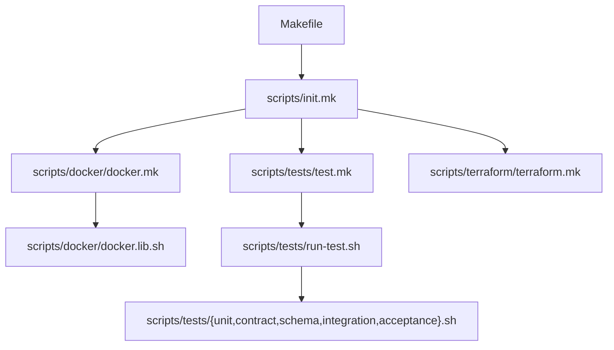

# Scripts

Shared shell scripts, Make includes, and configuration files used across CI/CD pipelines, Git hooks, and local development. Most of these originate from the [NHS England Repository Template](https://github.com/nhs-england-tools/repository-template) and should not be edited directly — raise a PR against the template instead.

The top-level `Makefile` includes the Make files from this directory via `scripts/init.mk`.

## Project Structure

```text
scripts/
├── init.mk                                # Root Make include — pulls in docker.mk, test.mk, terraform.mk
├── shellscript-linter.sh                  # ShellCheck wrapper (native or Docker)
├── config/                                # Tool configuration files
│   ├── gitleaks.toml                      # Secret scanning rules (gitleaks)
│   ├── grype.yaml                         # Vulnerability scanner config (grype)
│   ├── hadolint.yaml                      # Dockerfile linter config (hadolint)
│   ├── .markdownlint.yaml                 # Markdown linter config
│   ├── pre-commit.yaml                    # Pre-commit hook definitions
│   ├── repository-template.yaml           # Repository template metadata
│   ├── syft.yaml                          # SBOM generator config (syft)
│   └── vale/                              # Prose style checker config (vale)
│       ├── vale.ini
│       └── styles/
├── devcontainer/                          # Dev container setup scripts
│   ├── configure-zsh.sh                   # Configures zsh (GPG, bashrc sourcing)
│   └── create-docker-network-if-required.sh  # Creates the gateway-local Docker network
├── docker/                                # Docker build, lint, and test helpers
│   ├── docker.mk                          # Make targets: docker-build, docker-lint, docker-push, docker-run
│   ├── docker.lib.sh                      # Bash function library for Docker operations
│   ├── dockerfile-linter.sh               # Hadolint wrapper (native or Docker)
│   ├── Dockerfile.metadata                # OCI metadata label block appended to Dockerfiles
│   └── tests/                             # Docker image test fixtures
├── githooks/                              # Pre-commit hook scripts
│   ├── scan-secrets.sh                    # Gitleaks secret scanner
│   ├── check-file-format.sh              # EditorConfig compliance check
│   ├── check-markdown-format.sh          # Markdown lint check
│   ├── check-english-usage.sh            # Vale prose style check
│   ├── check-terraform-format.sh         # Terraform fmt check
│   └── python-lint-and-format.sh         # Ruff format + lint check
├── proxygen/                              # Proxygen CLI helper files
├── reports/                               # Reporting and analysis scripts
│   ├── create-lines-of-code-report.sh    # Lines-of-code report (gocloc)
│   ├── create-sbom-report.sh             # Software Bill of Materials (syft)
│   └── scan-vulnerabilities.sh           # CVE scan against SBOM (grype)
├── terraform/                             # Terraform command wrappers
│   ├── terraform.mk                      # Make targets: terraform-init, terraform-plan, terraform-apply, terraform-destroy
│   ├── terraform.sh                      # Terraform wrapper (native or Docker)
│   └── terraform.lib.sh                  # Bash function library for Terraform operations
└── tests/                                 # Test runner scripts
    ├── test.mk                            # Make targets: test-unit, test-contract, test-schema, etc.
    ├── run-test.sh                        # Generic pytest runner — delegates to the correct test path
    ├── unit.sh                            # Runs unit tests via run-test.sh
    ├── acceptance.sh                      # Runs acceptance tests via run-test.sh
    ├── contract.sh                        # Runs contract tests via run-test.sh
    ├── integration.sh                     # Runs integration tests via run-test.sh
    ├── schema.sh                          # Runs schema tests via run-test.sh
    ├── coverage.sh                        # Merges coverage from all test types for SonarCloud
    └── style.sh                           # Runs prose style checks (vale)
```

## How It Fits Together

The following diagram shows how the Make includes chain together from the top-level `Makefile`:



## Key Make Targets

Defined across the Make includes and available from the project root:

| Target | Source | Description |
| --- | --- | --- |
| `make test-unit` | `test.mk` | Run unit tests |
| `make test-contract` | `test.mk` | Run contract tests |
| `make test-schema` | `test.mk` | Run schema tests |
| `make test-integration` | `test.mk` | Run integration tests |
| `make test-acceptance` | `test.mk` | Run acceptance tests |
| `make docker-build` | `docker.mk` | Build the Gateway API Docker image |
| `make docker-lint` | `docker.mk` | Lint the Dockerfile with hadolint |
| `make docker-push` | `docker.mk` | Push the Docker image to the registry |
| `make terraform-init` | `terraform.mk` | Initialise Terraform |
| `make terraform-plan` | `terraform.mk` | Plan Terraform changes |
| `make terraform-apply` | `terraform.mk` | Apply Terraform changes |
| `make githooks-config` | `init.mk` | Install pre-commit hooks |
| `make githooks-run` | `init.mk` | Run all pre-commit hooks against all files |
| `make shellscript-lint-all` | `init.mk` | Lint all shell scripts in the repository |

## Git Hooks

Pre-commit hooks are configured in `config/pre-commit.yaml` and run the scripts in `githooks/`. Install them with:

```bash
make githooks-config
```

The hooks run automatically on each commit, checking for:

- Hardcoded secrets (gitleaks)
- File format compliance (EditorConfig)
- Markdown formatting
- English prose style (vale)
- Terraform formatting
- Python lint and formatting (ruff)

## Make and Bash Conventions

Make targets follow this signature format:

```makefile
some-target: # Target description - mandatory: foo=[description]; optional: baz=[description, default is 'qux'] @Category
    # Recipe implementation (max 5 lines — delegate to a shell script for complex operations)
```

- Target names use **kebab-case**; prefix with `_` to mark as "private"
- The first part of the name groups related targets (e.g. `docker-*`, `terraform-*`)
- `@Category` groups targets in `make help` output
- **Uppercase** variables are global/environment-level; **lowercase** variables are local arguments

Pass variables to targets using either form:

```shell
foo=bar make some-target   # environment variable
make some-target foo=bar   # make argument
```

All targets run in a single shell invocation (`.ONESHELL:` is set in `scripts/init.mk`), and all targets are added to `${VERBOSE}.SILENT:` to suppress command echo.

### Debugging

Set `VERBOSE=1` to print all executed commands:

```shell
VERBOSE=1 make docker-build        # for Make targets
VERBOSE=1 scripts/shellscript-linter.sh  # for Bash scripts
```

Set `FORCE_USE_DOCKER=1` to force a script to run its tools from Docker containers instead of native `PATH` binaries:

```shell
FORCE_USE_DOCKER=1 scripts/shellscript-linter.sh
```

## Secret Scanning

Hard-coded secrets are detected using [Gitleaks](https://github.com/gitleaks/gitleaks). The scanner runs as a pre-commit hook on each commit and as part of the CI/CD pipeline.

Key files:

| File | Purpose |
| --- | --- |
| `githooks/scan-secrets.sh` | Runs the gitleaks scan |
| `config/gitleaks.toml` | Custom secret scanning rules |
| `.gitleaksignore` (repo root) | Fingerprints to exclude (false positives) |

Run a full scan across all commits locally:

```shell
ALL_FILES=true ./scripts/githooks/scan-secrets.sh
```

If secrets are accidentally committed, use [BFG Repo-Cleaner](https://github.com/rtyley/bfg-repo-cleaner) or [git-filter-repo](https://github.com/newren/git-filter-repo) to remove them from history.

## Dependency Scanning

[Syft](https://github.com/anchore/syft) generates a Software Bill of Materials (SBOM) and [Grype](https://github.com/anchore/grype) scans it for known CVEs. Both run as part of the CI/CD pipeline.

Key files:

| File | Purpose |
| --- | --- |
| `reports/create-sbom-report.sh` | Generates an SBOM (syft) |
| `config/syft.yaml` | SBOM generator configuration |
| `reports/scan-vulnerabilities.sh` | Scans for CVEs (grype) |
| `config/grype.yaml` | CVE scanner configuration |

Run locally:

```shell
# Generate SBOM
./scripts/reports/create-sbom-report.sh
cat sbom-repository-report.json | jq

# Scan for vulnerabilities
./scripts/reports/scan-vulnerabilities.sh
cat vulnerabilities-repository-report.json | jq
```

## Static Analysis (SonarCloud)

[SonarCloud](https://sonarcloud.io) performs continuous code quality inspection and static analysis. Analysis runs automatically in the CI/CD pipeline test stage after unit tests complete, including code coverage reporting.

Locally, install the [SonarQube for IDE](https://marketplace.visualstudio.com/items?itemName=SonarSource.sonarlint-vscode) VS Code extension for real-time feedback. It can optionally be configured in connected mode with SonarCloud to synchronise quality profiles.

Key files:

| File | Purpose |
| --- | --- |
| `config/sonar-scanner.properties` | SonarCloud project configuration |

## Testing GitHub Actions Locally

[nektos/act](https://github.com/nektos/act) lets you run GitHub workflow jobs locally using Docker containers, useful for debugging CI/CD issues without pushing code.

Prerequisites: `act` and `docker` must be installed.

```shell
make runner-act workflow="stage-1-commit" job="create-lines-of-code-report"
```

## Signing Commits

Git commits should be signed. The project supports signing with either **GPG** (recommended) or **SSH** keys. See the [GitHub documentation on commit signature verification](https://docs.github.com/en/authentication/managing-commit-signature-verification/about-commit-signature-verification) for full setup instructions.

Quick setup (GPG):

```shell
# Configure Git to use your GPG key
git config --global user.signingkey <YOUR_GPG_KEY_ID>
git config --global commit.gpgsign true
```

After signing, commits pushed to GitHub display a `Verified` badge.
